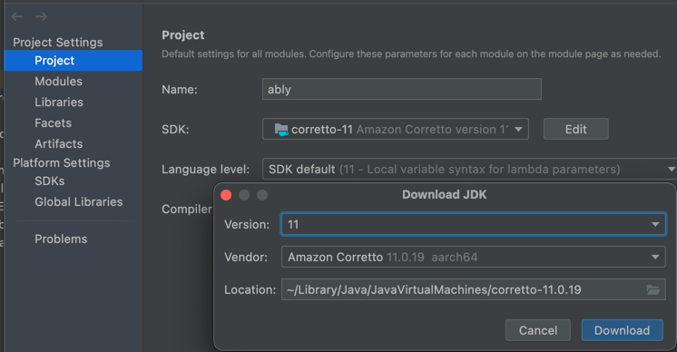
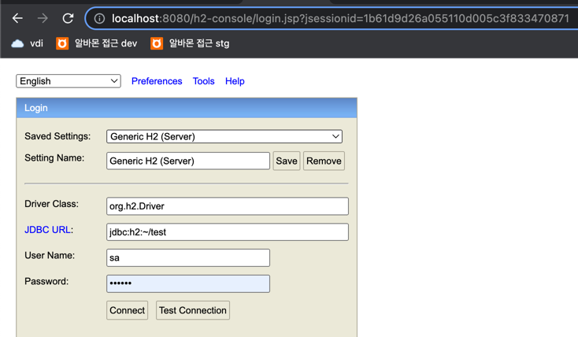
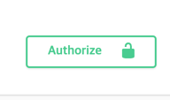

# With Springboot framework
Spring Boot, JAVA 11, MyBatis, Swagger3, H2를 사용하였습니다.

# 선행조건
1. JDK는 11버전으로 부탁드립니다.
```
Project Structure - Project - Add SDK - Download JDK
```


2. Local 환경이다 보니 h2 설정이 필요합니다.

# H2 DB 설정
1. http://localhost:8080/h2-console 에서 접근 가능합니다.
2. 설정은 아래 이미지를 참고 부탁드립니다. 계정은 sa/123qwe 입니다.

3. 테이블은 어플리케이션 실행시 자동 생성됩니다.
4. 테이블 정보는 resources - schema.sql에 기재되어 있습니다.

# Swagger URL & API 명세
```
API 목록 및 테스트는 http://localhost:8080/swagger-ui/index.html#/ 에서 가능합니다.
각 API 별 요청 & 응답 명세 또한 swagger 에서 확인 가능합니다.
```

* 회원가입 API (POST /member/sign-up)
```
회원가입시 멤버의 기본서랍이 생성됩니다.
```

* 로그인 API (POST /member/login)
```
로그인 API 호출시 JWT 토큰을 발급받을 수 있습니다.
해당 값을 복사하여 swagger 페이지의 Authorize에 입력 부탁드립니다.
회원가입 API 와 로그인 API 를 제외하고는 모두 로그인이 필요합니다.
```


* 회원 정보 조회 API (GET /MEMBER)
```
현재 로그인된 멤버의 정보를 확인할 수 있습니다.
```

* 찜 서랍 생성 API (POST /folder)
```
내 찜서랍에 동일한 이름의 서랍을 가지고 있는 경우 생성이 되지 않습니다.
```

* 찜 서랍 삭제 API (DELETE /folder)
```
기본 서랍 삭제는 되지 않습니다.
찜서랍 삭제시 해당 찜서랍 하위의 찜 정보 또한 모두 삭제됩니다.
```

* 찜 서랍 조회 API (GET /folder)
```
내 찜서랍의 정보를 확인할 수 있습니다.
```

* 찜하기 API (POST /wish)
```
folderNo(찜서랍 번호)를 지정하지 않는다면 기본 찜서랍에 찜이 저장됩니다.
다른 찜서랍에 저장되어있는 상품이라면 찜하기가 불가합니다.
```

* 찜해제 API (DELETE /wish)
```
```

* 찜하기 정보 조회 API (GET /wish)
```
내 찜서랍별 설정된 찜정보를 확인할 수 있습니다.
```

# 참고 사항
```
1. 기본 상품 더미 데이터는 어플리케이션 실행시 자동으로 들어갑니다.
2. 로그인시 권한에 대한 처리는 하지 않았습니다.
3. 찜서랍 생성/삭제, 그리고 찜하기/해제 API 의 실질적인 로직을 수행하는 클래스들은 모두 default 접근 제한자를 가집니다. 
이는 같은 패키지의 public class(FolderService, WishService)를 통해서만 접근이 가능합니다.

